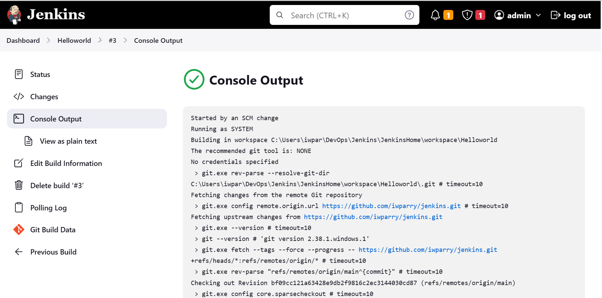
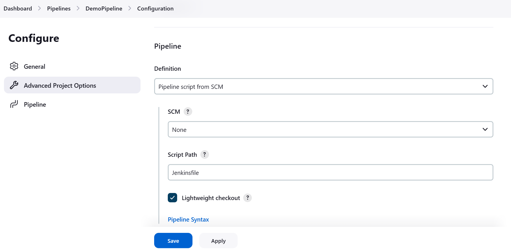
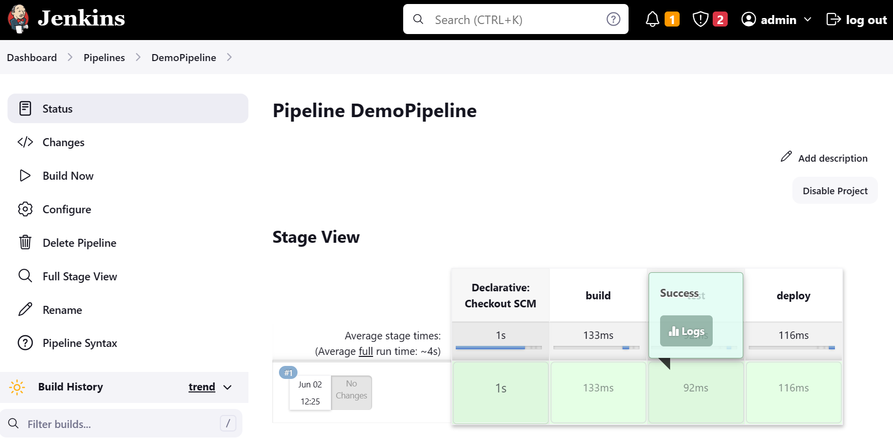

# Jenkins
This is my Jenkins repo where I play around with the tool

## Triggering a Jenkins build by monitoring a GitHub repository and executing when a change is detected
 I have configured a project in Jenkins to monitor this repo for code changes and to trigger a build if a change is detected.



A job will be triggered in this particular project each time it detects a change to the repository (via the poll SCM build trigger).

## Using a Jenkinsfile for a Pipeline in Jenkins
It is possible for us to build a pipeline in Jenkins via code, we can do this via a Jenkinsfile which allows us to to define our pipeline using declarative code.

Here is our first Jenkinsfile:
```java
pipeline {

    agent any  // Here we declare where we want our pipeline to be executed
               // i.e. in a cluster of Jenkins slaves and master we specify which node the job will be executed

    stages {  // The stages is where the actual workflow is specified

        stage("build") { // A task to be executed in a Jenkins pipeline workflow
            steps {  // Steps to execute a task in the workflow
                echo 'building the app...'
            }
        }
        stage("test") {
            steps {
                echo 'testing the app...'
            }
        }
        stage("deploy") {
            steps {
                echo 'deploying the app...'
            }
        }
    }
}
```
This is a simple pipeline with a few stages in the workflow that will simple output some strings to the console. To run this in Jenkins we create a new item, select type _Pipeline_. In the configuration scroll down to _Pipeline_ here you will either directly enter a pipeline script for your project, or you can have Jenkins find the script from a repository, in this case I have gone with finding the script in a repository (specifically this one).



Under _SCM_ select __Git__, then you will be asked to provide the repo URL along with any credentials if needed. You will also be asked to specify the branch to build (can leave blank for any) I've gone with __main__ in this case.

Apply and save, then trigger a build to verify that your pipeline works.



As you can see here our Pipeline was executed successfully! You can check the logs for each stage individually or you can go to the console output to see the full result of the pipeline build.